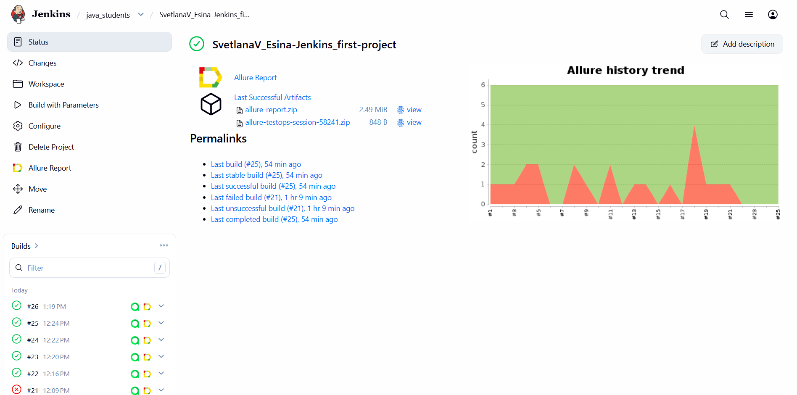
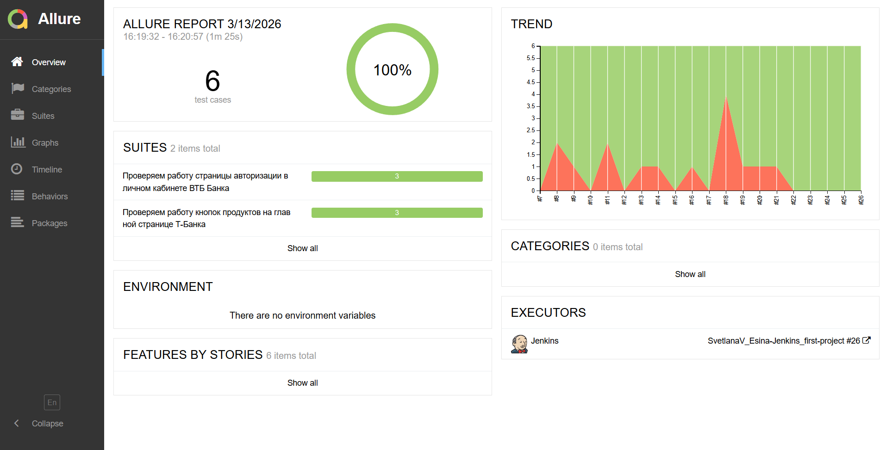
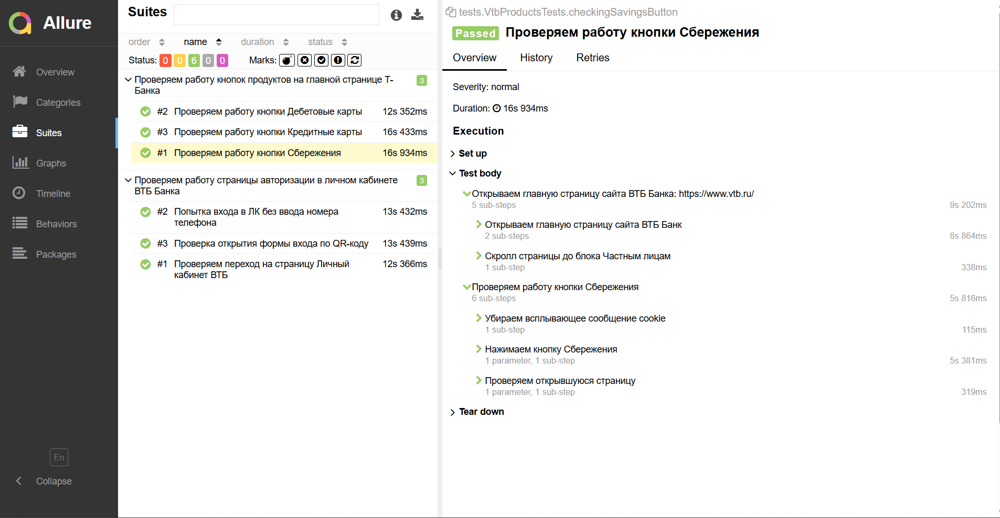
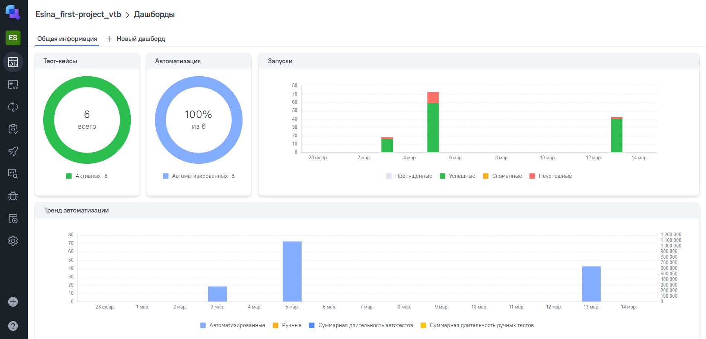
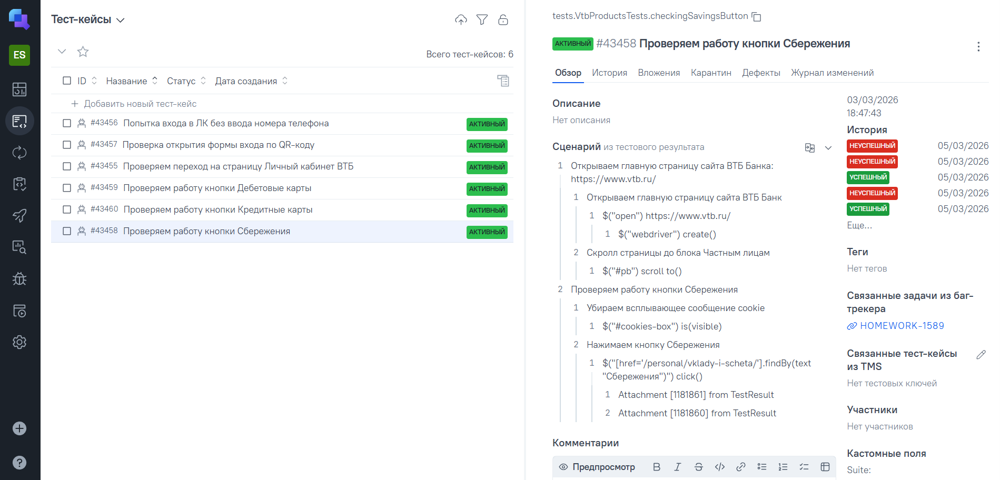
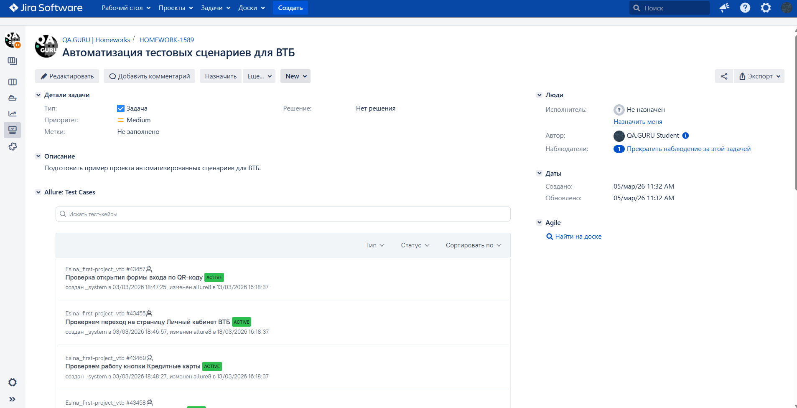

# Проект по автоматизации тестовых сценариев для ["ВТБ"](https://www.vtb.ru/)

## :clipboard: Содержание:

- [Технологии и инструменты](#computer-технологии-и-инструменты)
- [Сборка в Jenkins](#img-srcmediaiconsjenkinssvg-titlejenkins-width3-сборка-в-jenkins)
- [Allure-отчет](#img-srcmediaiconsallure_reportsvg-titleallure_report-width3-allure-отчет-)
  - [Overview](#overview)
  - [Детализаци отчета](#детализация-отчета)
- [Видео выполнения автотеста](#movie_camera-видео-выполнения-автотеста)
- [Интеграция с Allure TestOps](#img-srcmediaiconsjirasvg-titlejira-width3-интеграция-с-allure-testops)
  - [Дашборд](#дашборд)
- [Интеграция с Jira](#img-srcmediaiconsjirasvg-idjira-width3-интеграция-с-jira)
- [Уведомление в Telegram](#img-srcmediaiconstelegramsvg-titlejira-width3-уведомление-в-telegram)

## :computer: Технологии и инструменты:

- В данном проекте представлены автоматизированные тесты разработанные на языке <code>Java</code> с использованием фреймворка <code>Selenide</code>.
- В качестве сборщика использован <code>Gradle</code>.  
- В качестве фреймворка модульного тестирования использован <code>JUnit 5</code>.
- Для прогона тестов в браузере используется [Selenoid](https://aerokube.com/selenoid/).
- Для удаленного запуска тестов реализована джоба в [Jenkins](https://jenkins.autotests.cloud/view/java_students/job/SvetlanaV_Esina-Jenkins_first-project/).
- Реализовано формирование [Allure-отчета](https://jenkins.autotests.cloud/view/java_students/job/SvetlanaV_Esina-Jenkins_first-project/26/allure/) с отправкой результатов прогона тестов в <code>Telegram</code> при помощи бота.
- В проекте так же задействована интеграция с [Allure TestOps](https://allure.autotests.cloud/project/5150/test-cases/43456?treeId=0) и [Jira](https://jira.autotests.cloud/browse/HOMEWORK-1589).

##  Сборка в Jenkins:

##  Allure-отчет:  
### Overview

### Детализация отчета

## :movie_camera: Видео выполнения автотеста:

<video src="media/Video.mp4" controls="controls" autoplay="autoplay" width="600" height="400">
</video>

##  Интеграция с Allure TestOps:
### Дашборд

### Тест-кейсы

##  Интеграция с Jira:

##  Уведомление в Telegram: